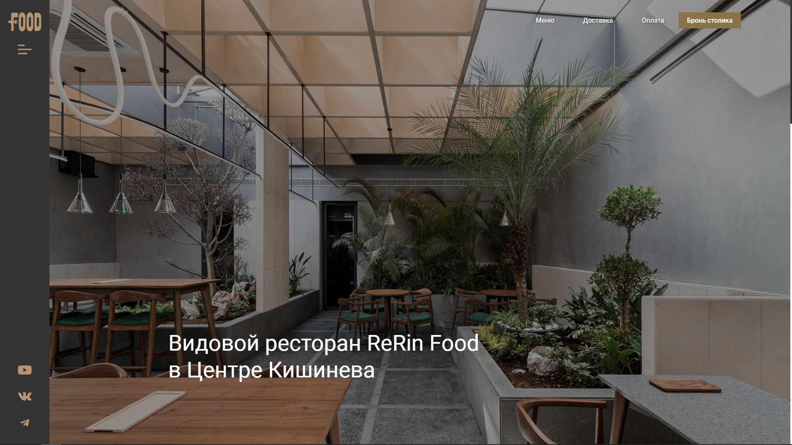
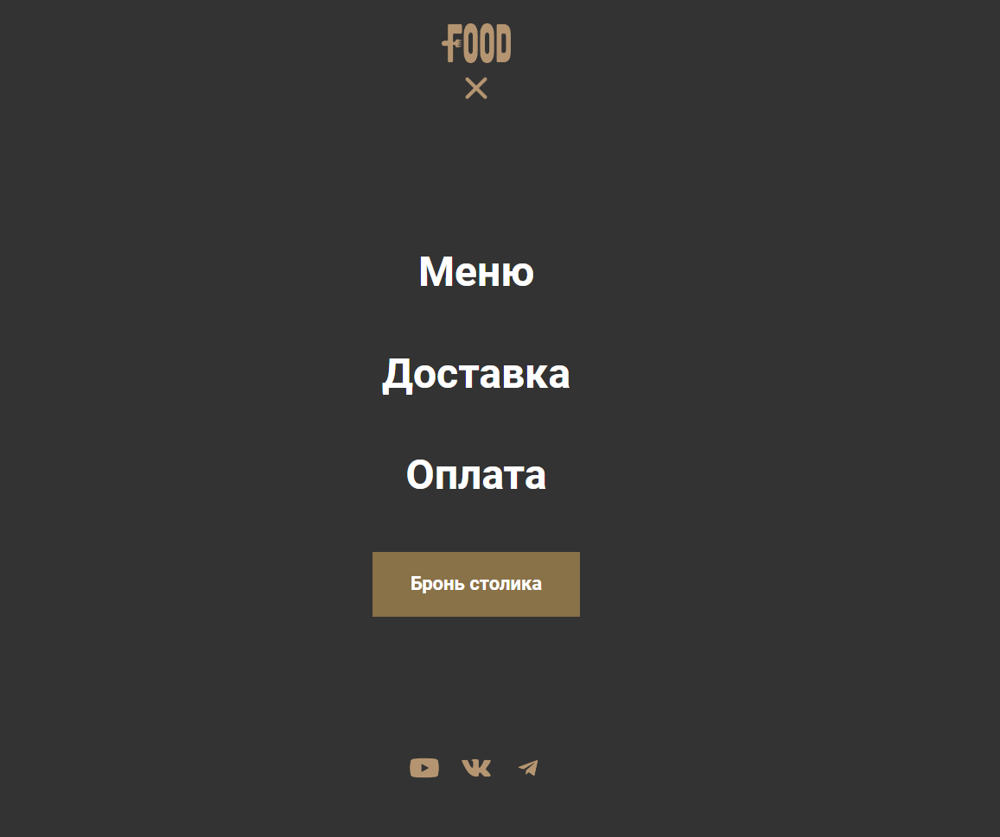
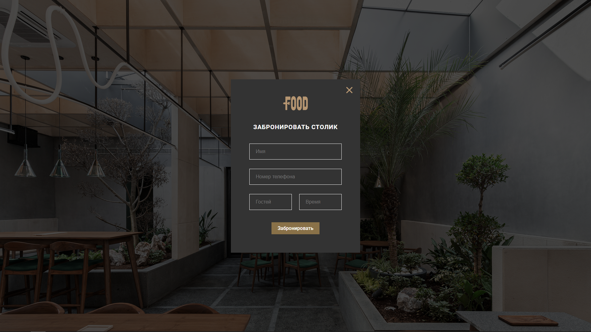
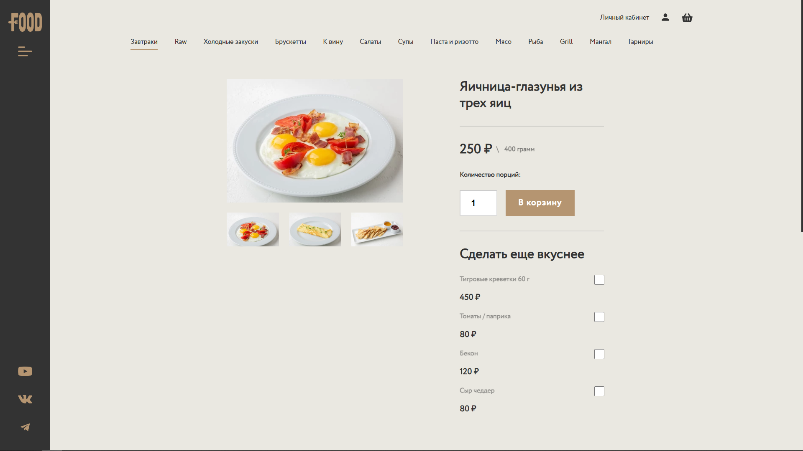
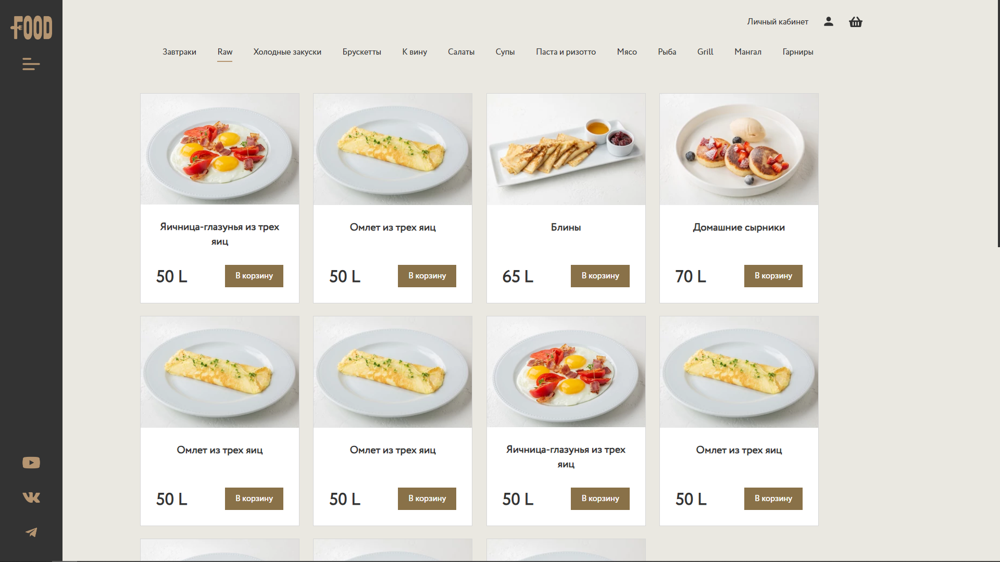

<H1> ReRin Food: A Modern Restaurant Web Application Powered by React.js</H1>

**ReRin Food** is a dynamic web application tailored for restaurants, developed using **React.js**, **JavaScript**, and **SCSS**. This application offers a seamless user experience with both vertical and horizontal navigation options.

## Key Features:

- **Intuitive Navigation:** Enjoy effortless navigation through the application with user-friendly vertical and horizontal menus.
- **Menu Management:** Administrators can easily add, delete, and modify dishes, ensuring the menu is up-to-date and reflecting the latest offerings.
- **Secure Authentication:** A secure authentication system provides admin access, ensuring only authorized personnel can manage the menu and settings.
- **Comprehensive Dish Catalog:** A meticulously curated catalog showcases a wide range of delectable dishes, complete with detailed descriptions and images.
- **Seamless Ordering Process:** Customers can conveniently browse the menu, place orders, and even complete payments directly on the website.
- **Responsive Design:** The application boasts a responsive design, ensuring optimal performance and functionality across various devices.

ReRin Food is a one-stop solution that bridges the gap between restaurant management and customer satisfaction. With its robust feature set and elegant design, it delivers a modern dining experience for both restaurant staff and patrons. Elevate your restaurant's online presence with ReRin Food and redefine the way you connect with your customers.

## Screenshots:

**Hamburger menu:**

 

**Reserve table:**

**Dish page:**

**Catalogue:**

